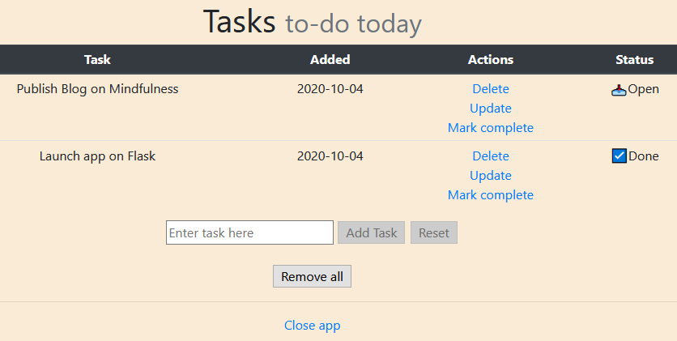

# TODO-ay
To-do app with CRUD operations using Flask, a Python web microframework
Deployed on https://flaskcrud-apptodo.herokuapp.com/

### Setup Tools
- Server-side: Flask with SQLite DB using Flask-SQLAlchemy ORM, deployed via Heroku
- Client-side: HTML, CSS with Bootstrap components, JS with Flask's Jinja templates

### Learning Resources
1. Harvard's CS50
2. Freecodecamp

#### Note
It is not advisable to use Sqlite3 on a Production server with Session Type as "filesystem" as shown in this app. Heroku uses an ephemeral filesystem. This project was created to explore Flask in detail and the ability to run CRUD operations and create a persistence layer with SQL. It is advised to use PostgreSQL with Heroku while deploying your Flask applications.